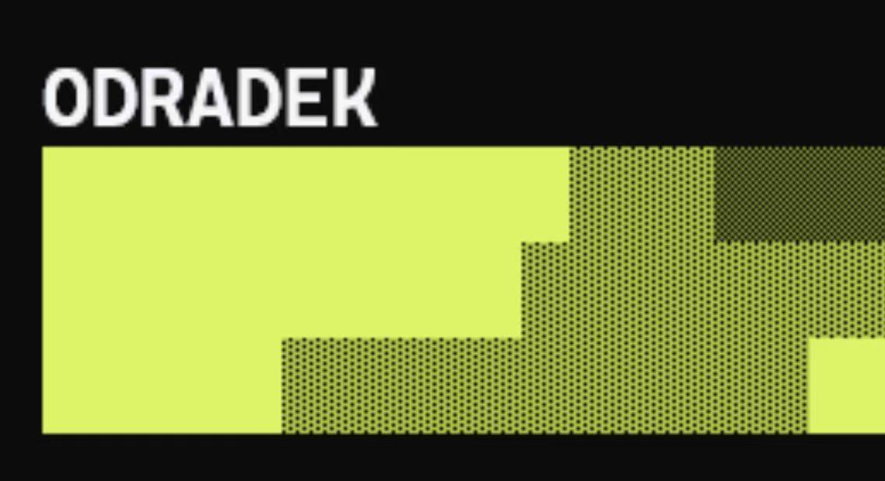
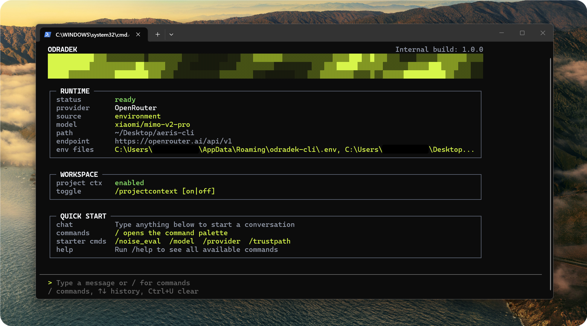
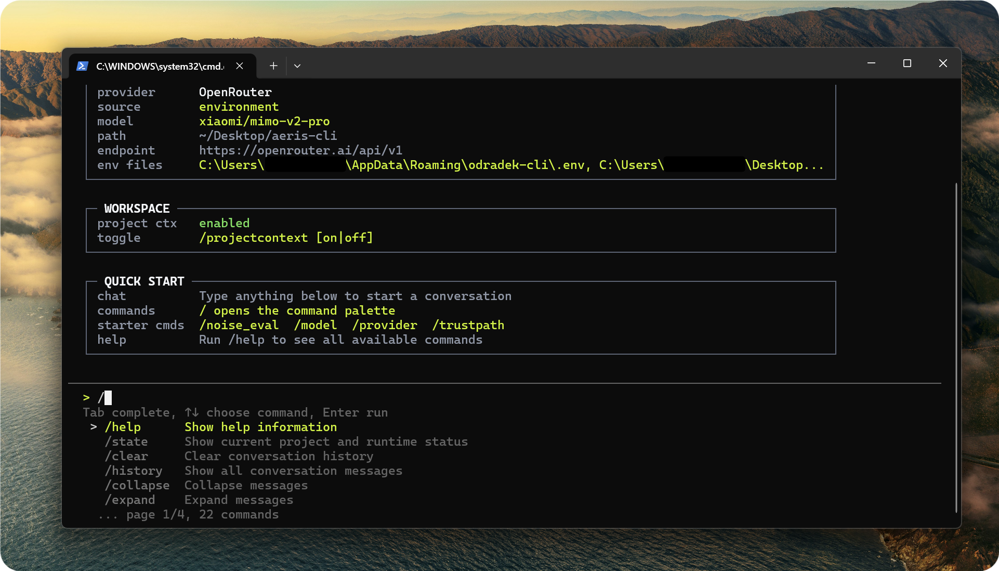
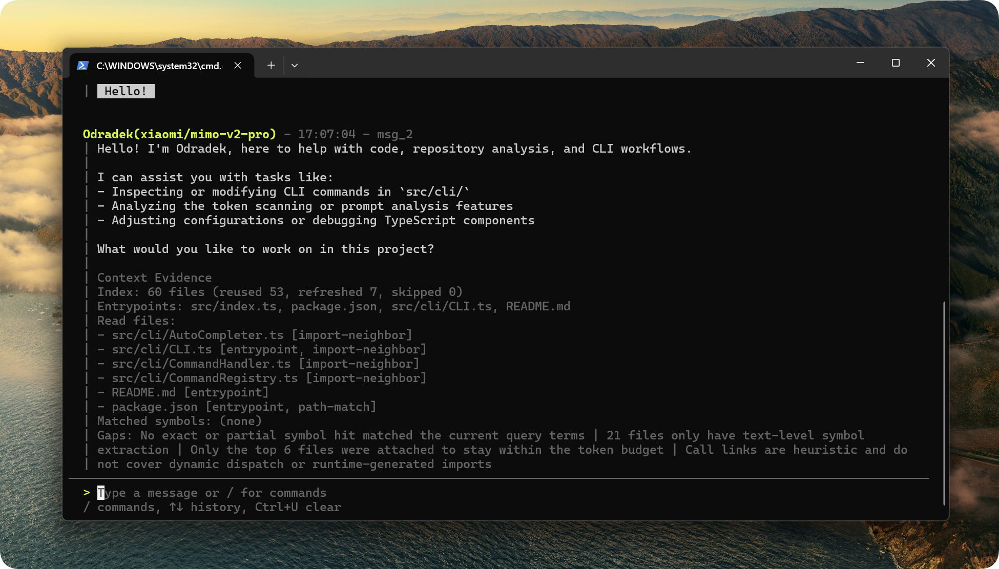
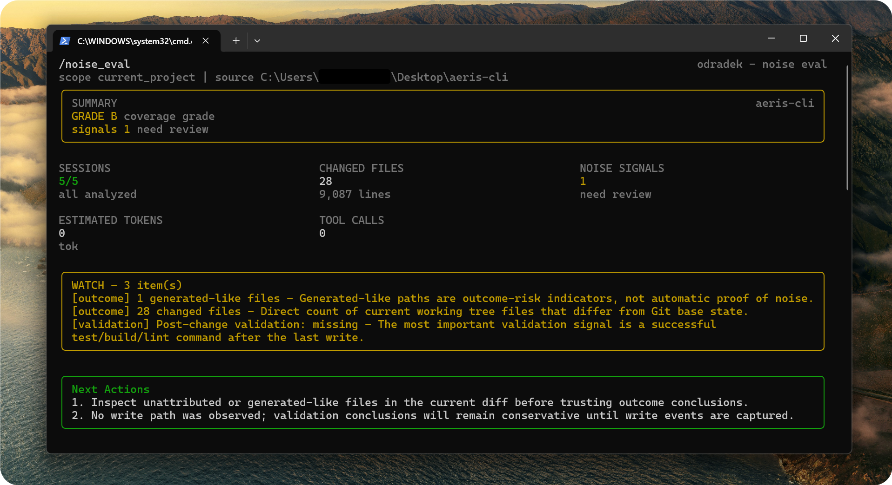
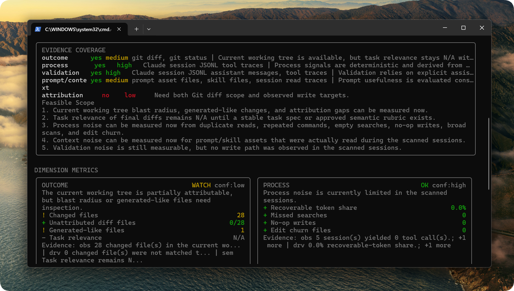

<div align="center">

# Odradek


[](https://github.com/chaobo8484/odradek-cli/blob/main/LICENSE)


[](https://x.com/Xiayin8484)

**English** | [简体中文](README.zh-CN.md)

</div>

## Project Overview

Odradek is a terminal-native CLI for Claude Code workflows, with support for more agent setups on the way. It brings interactive chat, provider switching, prompt and skill inspection, Claude JSONL diagnostics, and evidence-first noise evaluation into one workspace-aware tool.



## Why Odradek

- Stay inside the terminal for both chat and workflow diagnostics.
- Switch between Claude and OpenRouter in the same session with `/provider` and `/model`.
- Inspect prompt, rules, agent, and skill assets before they quietly bloat your context window.
- Parse Claude JSONL records to understand token structure and context pressure.
- Run evidence-first noise evaluation across outcome, process, context, and validation.
- Stay conservative when evidence is incomplete: return `N/A` instead of guessing.

## Preview

<div align="center">
<table>
<tr>
<td></td>
<td></td>
</tr>
<tr>
<td></td>
<td></td>
</tr>
</table>
</div>

## Feature Areas

| Area | What it covers | Key commands |
| --- | --- | --- |
| Runtime control | Provider / model switching, trust checks, project-context toggle, workspace state | `/state`, `/provider`, `/model`, `/trustpath`, `/projectcontext` |
| Prompt and skill assets | Prompt / rules / agent scan, rule extraction, skills overview, layered system prompts | `/scan_prompt`, `/rules`, `/skills` |
| Session diagnostics | Token structure, context health, evidence-first noise evaluation, todo granularity | `/scan_tokens`, `/context_health`, `/noise_eval`, `/todo_granularity` |
| Conversation tools | Help, history, collapse/expand, export | `/help`, `/history`, `/collapse`, `/expand`, `/export` |

## Requirements

- Node.js `>= 20`
- npm `>= 9`

## Production Install

If you are a regular user and just want to use Odradek, install and configure it like this.

Install globally:

```bash
npm install -g odradek-cli
odradek
```

Or run it once without installing globally:

```bash
npx odradek-cli@latest
```

## Production Configuration

Odradek reads provider settings from environment variables. For an installed CLI, you can provide them in any of these places:

- App-level `.env` or `.env.local`
- Workspace `.env` or `.env.local`
- Shell environment variables

Recommended app-level paths:

```text
Windows: %APPDATA%/odradek-cli/.env
macOS:   ~/Library/Application Support/odradek-cli/.env
Linux:   ~/.config/odradek-cli/.env
```

Workspace files load after the app-level directory, so repo-specific settings can override your defaults.

Claude example:

```env
ODRADEK_ACTIVE_PROVIDER=claude
ODRADEK_CLAUDE_API_KEY=your_claude_api_key
ODRADEK_CLAUDE_BASE_URL=https://api.anthropic.com/v1
# ODRADEK_CLAUDE_MODEL=claude-sonnet-4-20250514
ODRADEK_PROJECT_CONTEXT_ENABLED=true
```

OpenRouter example:

```env
ODRADEK_ACTIVE_PROVIDER=openrouter
ODRADEK_OPENROUTER_API_KEY=your_openrouter_api_key
ODRADEK_OPENROUTER_BASE_URL=https://openrouter.ai/api/v1
ODRADEK_OPENROUTER_MODEL=provider/model-name
ODRADEK_PROJECT_CONTEXT_ENABLED=true
```

Qwen example:

```env
ODRADEK_ACTIVE_PROVIDER=qwen
ODRADEK_QWEN_API_KEY=your_dashscope_api_key
ODRADEK_QWEN_BASE_URL=https://dashscope.aliyuncs.com/compatible-mode/v1
ODRADEK_QWEN_MODEL=qwen3.5-plus
ODRADEK_PROJECT_CONTEXT_ENABLED=true
```

## First Run

Start the installed CLI:

```bash
odradek
```

Recommended first commands:

```text
/state
/provider
/model
/noise_eval current
```

On first launch, Odradek asks whether to trust the current working directory. After that, `.env`, `/provider`, and `/model` are usually enough to get the session ready.

## Configuration Reference

For installed usage, local development, CI/CD, and internal deployments, environment variables or a `.env` file are still the recommended setup.

Windows config path:

```text
%APPDATA%/odradek-cli/config.json
```

Priority, highest first:

1. Session model override set by `/model`
2. Shell environment variables or `.env`
3. Local config file and built-in defaults

Environment variables:

| Variable | Purpose |
| --- | --- |
| `ODRADEK_ACTIVE_PROVIDER` | Active runtime provider, supports `claude` or `openrouter` |
| `ODRADEK_CLAUDE_API_KEY` | Claude API key |
| `ODRADEK_CLAUDE_BASE_URL` | Claude-compatible API base URL |
| `ODRADEK_CLAUDE_MODEL` | Default Claude model |
| `ODRADEK_OPENROUTER_API_KEY` | OpenRouter API key |
| `ODRADEK_OPENROUTER_BASE_URL` | OpenRouter API base URL |
| `ODRADEK_OPENROUTER_MODEL` | Default OpenRouter model |
| `ODRADEK_PROJECT_CONTEXT_ENABLED` | Enable or disable automatic project-context injection |
| `ANTHROPIC_API_KEY` | Fallback Claude-compatible key name |
| `ANTHROPIC_BASE_URL` | Fallback Claude-compatible base URL |
| `OPENROUTER_API_KEY` | Fallback OpenRouter key name |

## Layered System Prompts

Odradek automatically loads layered system prompts before each model request.

Workspace prompt file paths:

```text
.odradek/system-prompts/base.md
.odradek/system-prompts/providers/<provider>.md
.odradek/system-prompts/models/<model>.md
```

For example:

```text
.odradek/system-prompts/providers/claude.md
.odradek/system-prompts/models/claude-sonnet-4-6.md
```

Load order:

1. `base.md`
2. `providers/<provider>.md`
3. `models/<model>.md`

Odradek also supports an app-level prompt directory next to the config directory:

```text
%APPDATA%/odradek-cli/system-prompts/
```

Workspace prompts load after app-level prompts, so you can fine-tune behavior for a specific repo without changing your global defaults.

## Development

Use this path only if you want to modify the source, test unreleased changes, or contribute to the project.

1. Install dependencies

```bash
npm install
```

2. Copy the environment template

```bash
cp .env.example .env
```

PowerShell:

```powershell
Copy-Item .env.example .env
```

3. Start the development CLI

```bash
npm run dev
```

4. Build and run the distributable CLI locally

```bash
npm run build
npm start
```

5. Optionally test the global command name against your local checkout

```bash
npm link
odradek
```

If you want to switch back from your local linked build to the published package:

```bash
npm unlink -g odradek-cli
```

Core scripts:

```bash
npm run dev    # start the development CLI
npm run build  # compile TypeScript to dist/
npm start      # run the built version
```

## Common Commands

| Command | Description |
| --- | --- |
| `/help` | Show all available commands |
| `/state` | Show workspace, runtime, config, and trust status |
| `/provider [claude\|openrouter\|qwen]` | Switch the active provider |
| `/model [model-name\|clear]` | Switch or clear the current session model override |
| `/trustpath` | Trust the current working directory |
| `/trustcheck` | Check whether the current directory is already trusted |
| `/projectcontext [on\|off\|status]` | Control or inspect project-context injection |
| `/skills [path]` | Scan local `SKILL.md` files and show a skills overview |
| `/scan_prompt` | Scan prompt, rules, and agent assets in the project |
| `/rules [path]` | Extract explicit rules and instructions from a workspace |
| `/scan_tokens [current\|all\|path]` | Parse Claude JSONL token structures |
| `/context_health [current\|all\|path]` | Inspect context-window health from JSONL records |
| `/noise_eval [current\|all\|path]` | Run evidence-first noise evaluation |
| `/context_noise [current\|all\|path]` | Compatibility alias for `/noise_eval` |
| `/todo_granularity [current\|all\|path]` | Analyze todo granularity against context load |
| `/history` | Show all conversation messages |
| `/collapse [id\|all]` | Collapse history messages |
| `/expand [id\|all]` | Expand history messages |
| `/export [filename]` | Export conversation history |
| `/exit` or `/quit` | Exit the CLI |

## Project Layout

```text
src/
|- cli/
|- config/
|- llm/
`- index.ts
```

## Release Workflow

If you are a contributor preparing a new npm release, follow this path.

1. Build the release package

```bash
npm run build
```

2. Inspect the final published contents

```bash
npm pack --dry-run
```

3. Publish to npm

```bash
npm publish
```

If you are publishing a scoped public package, use:

```bash
npm publish --access public
```

4. Verify the production install path

```bash
npx odradek-cli@latest
```

## Pre-release Checklist

```bash
npm run build
npm pack --dry-run
```

Before publishing, make sure that:

- You do not commit `.env`
- `dist/` has been generated
- API keys are injected only through environment variables
- `npm pack --dry-run` includes only the intended files

## Report Bugs

You can submit bugs, questions, and suggestions through [GitHub Issues](https://github.com/chaobo8484/odradek-cli/issues).

## About

As an independent developer, I welcome technical discussions, project collaboration, and career opportunities. You can reach me here:

| Contact | Address |
| --- | --- |
| Email | stratospherelabs@protonmail.com |
| Email | chaobo_pro at outlook dot com |
| X (Twitter) | [@Xiayin8484](https://x.com/Xiayin8484) |

## Star History

<a href="https://www.star-history.com/?repos=chaobo8484%2Fodradek-cli&type=date&legend=top-left">
 <picture>
   <source media="(prefers-color-scheme: dark)" srcset="https://api.star-history.com/image?repos=chaobo8484/odradek-cli&type=date&theme=dark&legend=top-left" />
   <source media="(prefers-color-scheme: light)" srcset="https://api.star-history.com/image?repos=chaobo8484/odradek-cli&type=date&legend=top-left" />
   
 </picture>
</a>
